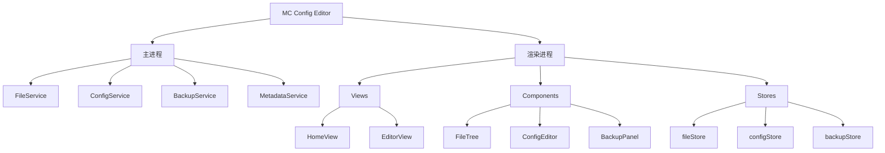

# Minecraft 配置文件可视化工具 (MC Config Editor)

> 项目 AI 上下文文档 - 更新于 2026-02-26

## 项目愿景

构建一个直观、易用的 Minecraft 服务端配置文件可视化编辑工具，帮助服务器管理员和玩家更轻松地理解、编辑和管理 Minecraft 的各类配置文件。

## 技术栈

| 层级 | 技术 | 版本 |
|------|------|------|
| 框架 | Electron | 29.x |
| 前端 | Vue 3 + Composition API | 3.4.x |
| 构建 | electron-vite + Vite | 5.x |
| 状态管理 | Pinia | 2.1.x |
| UI 组件 | Element Plus | 2.5.x |
| 语言 | TypeScript | 5.3.x |

## 架构总览

```
O:\pet\
├── electron/                       # Electron 主进程（已废弃，使用 src/main）
├── src/
│   ├── main/                       # Electron 主进程
│   │   ├── index.ts                # 主进程入口
│   │   └── services/               # 主进程服务
│   │       ├── FileService.ts      # 文件系统操作
│   │       ├── ConfigService.ts    # 配置解析与序列化
│   │       ├── BackupService.ts    # 备份管理
│   │       └── MetadataService.ts  # 元数据管理
│   ├── preload/                    # 预加载脚本
│   │   └── index.ts                # IPC 通信桥接
│   ├── common/                     # 公共类型定义
│   │   └── types.ts                # TypeScript 类型
│   └── renderer/                   # 渲染进程 (Vue 3)
│       ├── index.html              # HTML 入口
│       └── src/
│           ├── main.ts             # Vue 入口
│           ├── App.vue             # 根组件
│           ├── router.ts           # 路由配置
│           ├── components/         # UI 组件
│           │   ├── editor/         # 编辑器组件
│           │   ├── tree/           # 文件树组件
│           │   └── backup/         # 备份组件
│           ├── views/              # 页面视图
│           ├── stores/             # Pinia 状态管理
│           └── assets/             # 静态资源
├── resources/                      # Electron 资源
├── .zcf/plan/                      # 开发计划
├── electron.vite.config.ts         # electron-vite 配置
├── electron-builder.yml            # 打包配置
└── package.json                    # 项目配置
```

## 模块结构图



## 模块索引

| 模块路径 | 职责 | 状态 |
|----------|------|------|
| src/main/services/FileService.ts | 文件系统操作 | ✅ 完成 |
| src/main/services/ConfigService.ts | 配置解析与序列化 | ✅ 完成 |
| src/main/services/BackupService.ts | 备份管理 | ✅ 完成 |
| src/main/services/MetadataService.ts | 元数据管理 | ✅ 完成 |
| src/renderer/src/views/ | 页面视图 | ✅ 完成 |
| src/renderer/src/components/ | UI 组件 | ✅ 完成 |
| src/renderer/src/stores/ | 状态管理 | ✅ 完成 |

## 运行与开发

### 环境要求

- Node.js >= 18.x
- npm >= 9.x

### 快速开始

```bash
# 安装依赖
npm install

# 启动开发模式
npm run dev

# 构建生产版本
npm run build

# 打包 Windows 安装程序
npm run build:win
```

### IPC 接口

| 接口 | 说明 |
|------|------|
| file:selectDirectory | 选择服务端目录 |
| file:scanConfigs | 扫描配置文件 |
| file:read | 读取文件 |
| file:write | 写入文件 |
| config:parse | 解析配置 |
| config:serialize | 序列化配置 |
| backup:create | 创建备份 |
| backup:list | 备份列表 |
| backup:restore | 恢复备份 |
| backup:delete | 删除备份 |
| metadata:get | 获取元数据 |
| metadata:save | 保存元数据 |

## 支持的配置格式

| 格式 | 扩展名 | 解析器 |
|------|--------|--------|
| Properties | .properties | 自定义解析器 |
| YAML | .yml, .yaml | js-yaml |
| TOML | .toml | @iarna/toml |
| JSON | .json | 原生 JSON |

## 内置元数据

- `server.properties`: 完整的中文参数说明（30+ 字段）
- 支持用户自定义任意配置文件的元数据

## 编码规范

- 使用 TypeScript strict 模式
- Vue 组件使用 `<script setup>` 语法
- 遵循 ESLint + Prettier 规范
- 组件命名：PascalCase
- 文件命名：PascalCase

## 变更记录

| 日期 | 变更内容 |
|------|----------|
| 2026-02-26 | 项目初始化，完成核心功能开发 |
